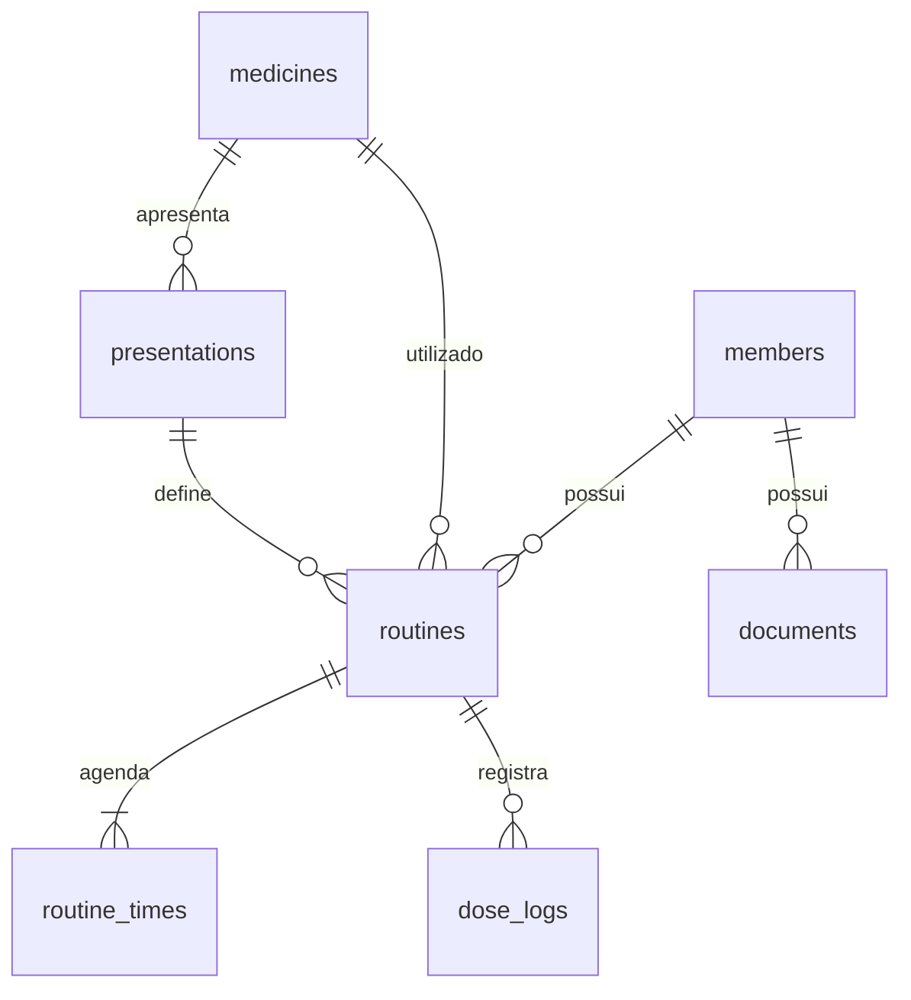

# Arquitetura do help-family

A aplicação web usa HTML, CSS e módulos JavaScript nativos. O servidor Node.js
atende a API Express e a interface pelo mesmo endereço local. SQLite persiste os
registros em tabelas relacionadas, acessadas pelo driver `better-sqlite3`.

## Evolução para contas e famílias separadas

O usuário confirmou o requisito de contas independentes. A arquitetura-alvo e a
transição estão em [Backend multiusuário](decisions/001-multiuser-backend.md).
Uma aplicação separada implementa contas, sessões e famílias com PostgreSQL,
em localhost:3002. Sua estrutura, instalação, endpoints e limites estão no
[guia de contas](ACCOUNTS.md). Suas telas de acesso e seleção de família são
geradas pelo servidor e funcionam sem JavaScript. Nenhum dado clínico foi migrado. As demais seções abaixo descrevem o site atual em
localhost:3001: SQLite local, sem autenticação e sem isolamento por família.

## Organização e responsabilidades

| Pasta / arquivo                  | Responsabilidade                                            | Onde não colocar lógica        |
| -------------------------------- | ----------------------------------------------------------- | ------------------------------ |
| `frontend/index.html`            | Documento inicial e pontos de montagem                      | Regras de negócio e consultas  |
| `frontend/js/main.js`            | Transporte HTTP, estado visual e coordenação dos eventos    | SQL ou criptografia            |
| `frontend/js/router.js`          | Navegação por fragmentos (`#today`, `#family` etc.)         | Persistência                   |
| `frontend/js/api.js`             | `fetch`, revisão atual e gravações na API                   | Construção das telas           |
| `backend/web/pages/`             | HTML, filtros e cálculos de cada tela no servidor           | Chamadas diretas ao banco      |
| `frontend/js/components/`        | Controles compartilhados e formulários                      | Regras de integridade do banco |
| `frontend/css/base.css`          | Cores, temas e estilos globais                              | Layout específico de telas     |
| `frontend/css/layout.css`        | Navegação e estrutura responsiva compartilhada              | Regras de domínio              |
| `frontend/css/components.css`    | Controles compartilhados e diálogos                         | Tokens globais duplicados      |
| `backend/server.js`              | Inicialização HTTP, Vite e encerramento                     | Manipulação dos cadastros      |
| `backend/app.js`                 | Composição da aplicação e restrições de acesso              | SQL específico                 |
| `backend/routes/api.js`          | Contrato HTTP e encaminhamento ao serviço                   | Regras de negócio              |
| `backend/services/family.js`     | Validação de operações e transações                         | HTML                           |
| `backend/services/validation.js` | Validação dos dados e relacionamentos                       | Efeitos colaterais             |
| `backend/services/vault.js`      | Chaves e criptografia autenticada                           | Rotas HTTP                     |
| `backend/repositories/family.js` | Mapeamento de entidades, consultas e gravação SQL           | Interface                      |
| `backend/database/`              | Conexão e migrações numeradas                               | Formatação de respostas HTTP   |
| `scripts/`                       | Migração, backup e ferramentas locais                       | Código necessário no navegador |
| `tests/`                         | Integração da API, banco e navegador                        | Dados reais                    |
| `data/`                          | Banco, chave e backups locais, ignorados pelo Git           | Código-fonte                   |
| `legacy/`                        | Versão React/Vinext e Android originais durante a transição | Novas funcionalidades web      |

## Fluxo de uma alteração

1. O backend produz o HTML e os resultados da tela solicitada.
2. `main.js` recebe uma ação explícita do usuário e chama `api.js`.
3. O cliente envia os campos/comandos sem calcular dados e a revisão em `If-Match`.
4. A rota identifica a operação e delega ao serviço.
5. O serviço verifica a revisão, valida o resultado e executa uma transação.
6. O repositório cifra os campos de conteúdo e grava os registros envolvidos.
7. A API confirma a revisão; o navegador solicita e exibe o HTML atualizado.

As telas só mostram a alteração como salva depois da confirmação do servidor.
Uma revisão desatualizada recebe HTTP 409, sem sobrescrever os dados de outra aba.
O controle de revisão é global para toda a família, deliberadamente simples.

O navegador usa `/api/views/:page`, `/api/forms/:kind` e comandos em `/api/actions/`.
O endpoint `/api/state` permanece para compatibilidade de ferramentas locais e
não é mais chamado pelas telas. A importação do estado completo existe somente como
operação administrativa local. O serviço ainda valida uma fotografia completa do
estado para reaproveitar as verificações de relacionamentos da versão anterior.
A renderização e a validação ainda percorrem registros no servidor; o SQLite
ainda não foi otimizado para bancos grandes. A consulta das telas exclui os bytes
dos documentos no SQL; abrir um arquivo consulta somente seu registro. Veja
[Regras no backend](BACKEND-FIRST.md) para os limites e contratos dessa separação.

## Banco relacional

`members`, `medicines`, `presentations`, `routines`, `routine_times`, `dose_logs`
e `documents` substituem o registro JSON único. `metadata` guarda a revisão e a
marca de importação. Chaves estrangeiras impedem referências quebradas. Uma
apresentação deve pertencer ao medicamento da rotina; uma dose deve pertencer ao
familiar da rotina. Registros relacionados não são apagados em cascata, exceto
os horários que pertencem exclusivamente à rotina.

Cada dose tem um índice HMAC de rotina + data + horário. Registrar novamente a
mesma dose atualiza a ocorrência existente. Nomes de tabela e coluna vêm de uma
lista fixa no repositório; os valores recebidos usam parâmetros SQL.

## Proteção e limites

- Os campos de conteúdo são criptografados individualmente com AES-256-GCM.
- Cada campo utiliza um nonce aleatório e contexto de tabela, registro e coluna,
  que impede trocar silenciosamente o conteúdo criptografado entre registros.
- Identificadores, relacionamentos, ordem dos horários, estado ativo e revisões
  permanecem disponíveis ao SQLite. Não há criptografia integral do arquivo.
  IDs herdados da versão antiga podem conter nomes descritivos.
- A chave fica em `data/encryption.key`, com permissão de arquivo `0600`.
  Quem possui o banco e a chave pode acessar os dados. A proteção não substitui
  o controle de acesso ao computador.
- Se o banco existir e a chave estiver ausente, o servidor recusa a abertura.
  Uma chave nova não é criada silenciosamente para um banco existente.
- Os documentos web, limitados a 1 MB por arquivo, ficam cifrados na tabela
  `documents`. Isso mantém conteúdo e metadados no mesmo backup transacional.
- A API limita o corpo das requisições a 17 MiB (para comportar uma foto de 12 MB em base64). A validação também limita arrays,
  tamanhos de texto e formatos aceitos.
- O servidor escuta em `127.0.0.1`. Verifica Host, conexão local e origem.
  A API não habilita CORS; interface e servidor compartilham a mesma origem.
- O Vite só pode servir `frontend/` e dependências; banco, chave, arquivos de
  ambiente e código legado ficam fora da lista de arquivos permitidos.
- Valores inseridos em templates HTML passam por `escapeHtml`; conteúdo de TXT
  é exibido com `textContent`, sem execução de marcação do usuário.

## Interface e documentação do código

Cada módulo começa com a descrição de sua responsabilidade. Comentários devem
explicar decisões ou invariantes, especialmente em transações, criptografia e
compatibilidade. Use JSDoc nas fronteiras entre módulos; evite comentários que
apenas repitam cada linha de código.

Uma nova tela clínica entra em `backend/web/pages/`, é registrada em
`backend/web/screens.js` e recebe uma função de renderização no servidor. A
navegação visual fica em `frontend/js/router.js`; componentes HTML ficam em
`backend/web/components/` e interações com o DOM em `frontend/js/components/`. Um novo
recurso exige migração SQL, mapeamento no repositório, validação, documentação
do endpoint e testes de integração. Migrações aplicadas não devem ser editadas;
adicione uma migração numerada e amplie o executor de versões.

A organização visual está detalhada em [DESIGN.md](DESIGN.md). Os estilos de cada
tela ficam em `frontend/css/pages/`, e `frontend/css/forms.css` adapta os formulários
nativos ao painel lateral e aos modais da identidade original.

## Transição do Android

O Android original está preservado em `legacy/android/`. A nova interface web
ainda não foi integrada ao armazenamento e ao digitalizador nativos. O servidor
Node.js do computador não é executado dentro do APK. A próxima etapa móvel
precisa de um adaptador que respeite esse contrato e de testes no dispositivo.
Referências a documentos que existem somente no Android são preservadas, mas o
arquivo deve ser aberto no aplicativo original até sua migração.
