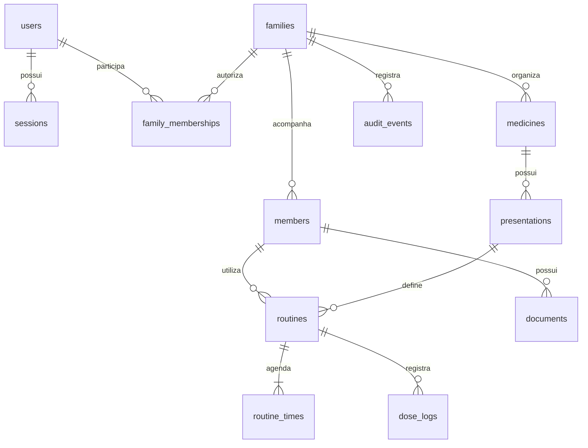

# Backend com contas e famílias separadas

Status: arquitetura-alvo em implementação na aplicação localhost:3002. Já foram
entregues contas, sessões, famílias, familiares com fotos e catálogo de medicamentos
com apresentações, rotinas, agenda e histórico de doses, PostgreSQL/RLS e telas HTML no servidor. Consulte
[Contas](../ACCOUNTS.md), [Familiares](../MEMBERS.md) e
[Medicamentos](../MEDICINES.md) e [Rotinas](../ROUTINES.md) e [Doses](../DOSES.md) para o escopo efetivo. O site anterior em
localhost:3001 ainda usa SQLite, sem login. Documentos, convites,
importação e outros itens abaixo continuam como plano de evolução.

## Objetivo e limites

Atender contas de usuários e famílias separadas, preservando a interface em HTML,
CSS e JavaScript. Desenvolvimento, execução e testes permanecem exclusivamente em
localhost, conforme `AGENTS.md`. Não há autorização de implantação ou publicação.

A unidade de isolamento é a família. Um usuário pode participar de várias famílias
com permissões distintas. Um familiar acompanhado pode não ter conta de acesso.
O cadastro de uma conta cria um espaço vazio; nunca concede acesso automático aos
dados anteriores, a outra conta ou a uma família existente.

## Arquitetura-alvo

Manter um único backend Node.js/Express, dividido por funcionalidade, com PostgreSQL
local. Essa escolha permite centralizar as regras de acesso e as transações sem
introduzir a operação de múltiplos serviços. Não pressupõe que a linguagem atual
seja um gargalo: os problemas observados são leituras integrais, descriptografia
excessiva e carregamento de arquivos junto das listagens.

PostgreSQL é a proposta para suportar evolução das relações, gravações concorrentes
e políticas de acesso por linha. Ter contas de usuários, isoladamente, não torna
SQLite inadequado. A troca de banco tampouco resolve autorização ou consultas mal
projetadas. A aprovação dos ganhos depende das medições descritas adiante.

```text
backend/
  server.js                 Inicialização e encerramento
  app.js                    Composição HTTP
  config/                   Configuração validada e restrição a localhost
  database/
    pool.js                 Pool PostgreSQL com limites definidos
    migrations/             Migrações sequenciais e transacionais
  middleware/
    session.js              Identificação da sessão
    csrf.js                 Proteção de operações autenticadas
    family-access.js        Verificação de vínculo e permissão
    errors.js               Erros sem exposição de dados internos
  modules/
    auth/                   Cadastro, login, logout e sessões
    users/                  Conta e credenciais do próprio usuário
    families/               Famílias, vínculos, papéis e convites
    members/                Pessoas acompanhadas
    medicines/              Catálogo privado da família e apresentações
    routines/               Regras de uso e horários
    dose-logs/              Registro e histórico de doses
    documents/              Metadados, upload e leitura autorizada
  shared/
    security/               Hash de senha, criptografia e controle de tentativas
    storage/                Leitura e escrita privada de arquivos
    audit/                  Eventos de acesso e alteração
```

Estrutura sugerida dentro de cada módulo: `routes.js`, `service.js`,
`repository.js` e `validation.js`. Criar arquivos conforme houver responsabilidade
real; não criar controladores que apenas repassem os mesmos parâmetros.

As rotas validam o contrato HTTP. Os serviços aplicam autorização e regras de
negócio. Os repositórios fazem consultas parametrizadas. A transação e o contexto
de família acompanham a operação inteira. Serviços não importam definições de
recursos de um repositório genérico, como acontece na implementação atual.

## Modelo relacional



- `users`: identidade de acesso, identificador de login normalizado e hash da senha.
- `sessions`: hash do token, usuário, expiração absoluta, última atividade e revogação.
- `families`: espaço de dados; seu nome não determina propriedade ou autorização.
- `family_memberships`: vínculo único entre usuário e família, com papel e estado.
- Recursos de saúde: `family_id` obrigatório, identificador e versão do registro.
- `documents`: metadados e identificador opaco do conteúdo privado.
- `audit_events`: ator, família, ação, recurso, resultado e instante; sem senha,
  token, conteúdo clínico ou bytes de arquivo.

As referências entre dados de saúde usam chaves estrangeiras compostas, por
exemplo `(family_id, member_id)` e `(family_id, presentation_id)`. O banco deve
recusar vínculos entre famílias diferentes mesmo que a aplicação cometa um erro.

## Permissões

| Operação                                       | Proprietário | Cuidador | Leitor |
| ---------------------------------------------- | ------------ | -------- | ------ |
| Consultar dados e abrir documentos da família  | Sim          | Sim      | Sim    |
| Cadastrar ou editar cuidados e registrar doses | Sim          | Sim      | Não    |
| Excluir cadastros e documentos                 | Sim          | Não      | Não    |
| Convidar usuários e alterar permissões         | Sim          | Não      | Não    |
| Transferir propriedade ou excluir a família    | Sim          | Não      | Não    |

É uma matriz inicial proposta. Na primeira entrega, cada nova conta cria sua
família como proprietária; compartilhamento entra depois, com convites explícitos,
expiráveis e de uso único. Não enviar convites ou mensagens durante testes.

A remoção do último proprietário deve ser recusada. Transferir propriedade requer
nova autenticação e uma transação. Revogar um vínculo deve impedir o acesso nas
requisições seguintes, sem esperar o fim da sessão.

Identificadores imprevisíveis não substituem autorização. Um `family_id` recebido
na URL ou no corpo é entrada não confiável. A API verifica a associação usando o
usuário da sessão e aplica o escopo também nas consultas e na leitura de arquivos.
Ausência de vínculo deve produzir uma resposta que não revele a existência dos
dados privados de outra família.

RLS (Row-Level Security) no PostgreSQL é uma defesa adicional, não a única
verificação. A conexão da aplicação não pode ser superusuária, proprietária das
tabelas nem possuir `BYPASSRLS`. O contexto é definido localmente à transação e
não pode vazar entre conexões reutilizadas pelo pool. Políticas precisam cobrir
leitura e escrita; testar também a ausência de contexto.

## Autenticação e proteção de dados

- Senhas com Argon2id, salt gerado pela biblioteca e custo calibrado localmente.
  Não armazenar senha em texto, criptografia reversível ou hash rápido genérico.
- Sessões opacas revogáveis, com token aleatório e apenas seu hash no banco.
  Renovar a sessão após autenticação; logout e alteração de senha revogam sessões.
- Cookie `HttpOnly`, `SameSite` e sem atributo `Domain`, com expiração definida.
  `Secure` exige transporte HTTPS apropriado. Documentar explicitamente o modo de
  desenvolvimento em HTTP loopback; nunca descrevê-lo como equivalente a HTTPS.
- Validar origem e proteção CSRF nas operações autenticadas que alteram dados.
  `SameSite` sozinho não substitui a proteção, inclusive entre portas de localhost.
- Limitar tentativas de autenticação por origem e identificador, com memória/estado
  limitado. Respostas de login não devem revelar se uma conta existe.
- Recuperação de conta e verificação de identidade precisam de um fluxo próprio.
  Não criar recuperação por perguntas pessoais ou conta administrativa padrão.
- Manter conteúdo sensível e arquivos cifrados, com chaves fora do Git, versionadas
  e separadas das credenciais de acesso. Ter acesso ao banco e às chaves continua
  permitindo descriptografar o conteúdo.
- Definir explicitamente os campos usados como metadados de consulta e índices.
  Criptografia de campo dificulta pesquisa; não prometer `LIKE` ou busca textual
  diretamente sobre os valores cifrados. Campos clínicos não devem virar texto
  aberto apenas para facilitar a indexação.

## Acesso eficiente aos dados

O endpoint global `/api/state` deixa de ser o mecanismo das telas no modelo novo.
As consultas ficam vinculadas à família e à tarefa solicitada:

```text
POST   /api/auth/register
POST   /api/auth/login
POST   /api/auth/logout
GET    /api/auth/session
GET    /api/families
POST   /api/families
GET    /api/families/:familyId/members
GET    /api/families/:familyId/agenda?date=AAAA-MM-DD
GET    /api/families/:familyId/dose-logs?cursor=...&limit=...
GET    /api/families/:familyId/documents?cursor=...&limit=...
GET    /api/families/:familyId/documents/:documentId/content
```

Os demais cadastros seguem esse mesmo escopo. Listagens têm limite máximo e
ordenação estável; o histórico usa paginação por cursor e filtros indexáveis.
Cada alteração valida somente seus campos e referências, dentro da transação.
A concorrência usa versão por registro, sem bloquear alterações independentes de
outras famílias por uma revisão global.

Índices iniciais: associação usuário/família; recursos por família; histórico por
família/data/ID; documentos por família/data/ID; ocorrência única da dose por
família/rotina/data/horário. Validar os planos de consulta antes de adicionar
índices redundantes. Reutilizar consultas em lote para evitar uma consulta extra
por rotina.

Arquivos deixam de aparecer em base64 no JSON de listagem. Armazená-los de forma
privada e cifrada, com limite de tamanho, verificação de tipo e identificadores
opacos, nunca com caminhos fornecidos pelo navegador. A leitura exige permissão
na família. Upload e remoção precisam compensar falhas entre armazenamento e
transação de metadados. Não publicar a pasta de documentos como conteúdo estático.

## Transição sem perder dados

1. Preparar PostgreSQL exclusivamente local, credenciais ignoradas pelo Git e
   funções distintas para migrações e execução. Não foi encontrado PostgreSQL,
   Docker ou Podman disponível no PATH na verificação inicial deste ambiente.
2. Criar migrações de contas, sessões, famílias e vínculos, sem alterar o SQLite.
3. Implementar e testar autenticação e a matriz de acesso com dados fictícios.
4. Migrar cada recurso e suas telas para consultas restritas por família.
5. Fazer backup consistente do SQLite, da chave e dos arquivos. Ensaiar a importação
   em uma cópia, verificando quantidades, relações e conteúdo dos documentos.
6. Atribuir o acervo anterior somente a uma conta e família escolhidas explicitamente
   pelo responsável. Nunca dar o acervo à primeira pessoa que se cadastrar.
7. Executar a importação de forma transacional ou com retomada controlada; registrar
   os IDs de origem para impedir duplicação e verificar integridade dos arquivos.
8. Trocar o backend usado pelo site somente depois dos testes de isolamento e de
   persistência. Manter o backup para recuperação; um retorno após novas gravações
   exige reconciliar os dados, não apenas apontar de volta para o SQLite antigo.

## Critérios de aceite

- Duas contas com famílias diferentes não conseguem listar, consultar, alterar,
  excluir ou baixar os dados uma da outra, mesmo conhecendo os IDs.
- Referências cruzadas são recusadas pela aplicação e pelas restrições SQL.
- Papéis são respeitados em toda operação, inclusive arquivos e importações.
- Logout, expiração e revogação de vínculo tornam acessos antigos inválidos.
- Sem contexto de família, o banco recusa ou não retorna dados protegidos.
- Duas requisições intercaladas no pool não trocam o contexto das famílias.
- Nenhuma listagem inclui senha, hash de senha, token, chave ou conteúdo de arquivo.
- Listar documentos não lê/descriptografa seus arquivos; registrar uma dose não
  carrega todas as tabelas. Essas propriedades entram nos testes de integração.
- Medir tempo p50/p95, memória, quantidade de consultas e tamanho das respostas
  com uma base fictícia pequena e outra ampliada. Comparar nas mesmas condições,
  registrando ambiente e carga; não prometer ganhos antes dessa medição.
- Repetir os testes de cadastro, agenda, histórico, documentos, tema e responsividade
  para evitar regressão na interface já recuperada.

## Referências

- [OWASP: autorização em cada requisição](https://cheatsheetseries.owasp.org/cheatsheets/Authorization_Cheat_Sheet.html)
- [OWASP: armazenamento de senhas](https://cheatsheetseries.owasp.org/cheatsheets/Password_Storage_Cheat_Sheet.html)
- [OWASP: sessões](https://cheatsheetseries.owasp.org/cheatsheets/Session_Management_Cheat_Sheet.html)
- [OWASP: proteção CSRF](https://cheatsheetseries.owasp.org/cheatsheets/Cross-Site_Request_Forgery_Prevention_Cheat_Sheet.html)
- [PostgreSQL: políticas de acesso por linha](https://www.postgresql.org/docs/17/ddl-rowsecurity.html)
- [SQLite: cenários de utilização](https://www.sqlite.org/whentouse.html)
